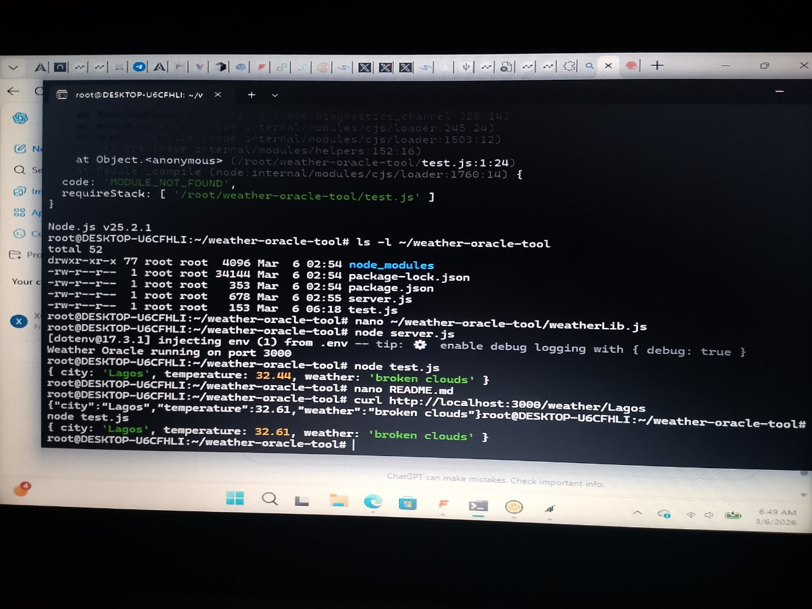

# Weather Oracle Tool for Intelligent Contracts


## Overview

This project is a **Weather Oracle** that allows intelligent contracts or applications to fetch weather data from external APIs securely.  
It demonstrates:

- External API integration (OpenWeatherMap)  
- Secure API key storage (hidden in `.env`)  
- A Node.js library (`weatherLib.js`) for easy consumption  
- A working demo (`test.js`) showing how to fetch weather data  

---

## Features

- Fetch live weather data (temperature, description) for any city  
- Keeps API keys private and secure  
- Simple JavaScript library for integration with contracts or applications  
- Easy to test and extend  

---

## Architecture

Intelligent Contract / App
|
v
weatherLib.js (Library)
|
v
Node.js API Proxy Server
|
v
OpenWeatherMap API (External)


---

## Installation

1. Clone the repository:

```bash
git clone <YOUR_GITHUB_REPO_URL>
cd weather-oracle-tool


Usage
Start the Oracle Server
node server.js

Server will run on port 3000.

Test the API with curl
curl http://localhost:3000/weather/Lagos

Expected output:

{
  "city": "Lagos",
  "temperature": 32.44,
  "weather": "broken clouds"
}
Test with the Library

Run:

node test.js

Expected output:

{ city: 'Lagos', temperature: 32.44, weather: 'broken clouds' }
Tech Stack

Node.js

Express.js

Axios

dotenv

OpenWeatherMap API

Notes

API keys are kept private in the .env file

You can replace "Lagos" with any city supported by OpenWeatherMap

The library (weatherLib.js) can be imported into other projects or intelligent contracts

## Demo Screenshot


